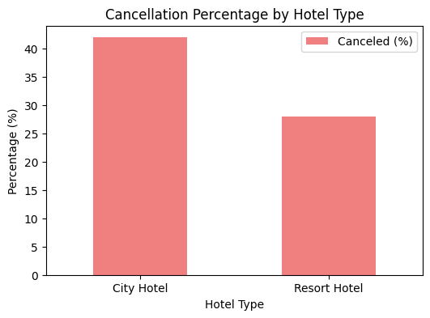
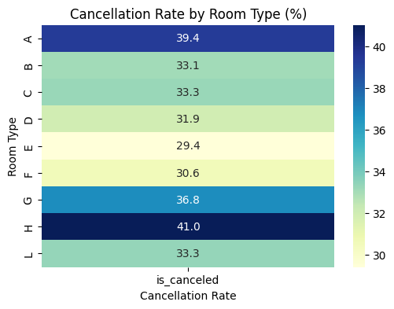
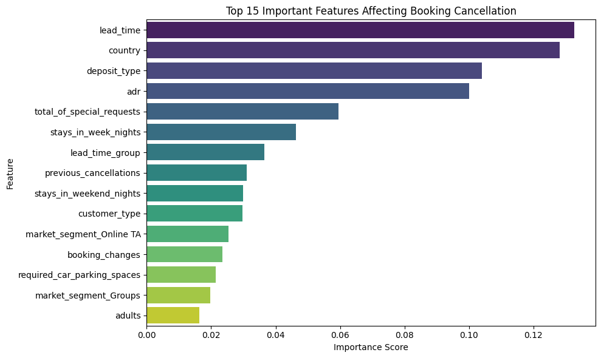

# Hotel Booking Cancellation Prediction

A machine learning project that predicts whether a hotel booking will be **cancelled**, using a real-world dataset of **119,390 bookings** from a City Hotel and a Resort Hotel. The project covers the full data science workflow: data cleaning, exploratory data analysis (EDA), feature engineering, model training and feature importance analysis.

**Result:** a Random Forest classifier with **87.92% test accuracy**.

> University coursework, University of Huddersfield

---

## Business Problem

Cancellations cost hotels revenue and make planning harder. If a hotel can predict which bookings are likely to be cancelled, it can adjust overbooking strategies, deposit policies and pricing. This project identifies the main drivers of cancellation and builds a model to predict them.

---

## Dataset

- **119,390 bookings**, 32 columns (lead time, room type, deposit type, country, average daily rate, special requests, and more)
- Target: `is_canceled` (0 = not cancelled, 1 = cancelled). About **37%** of bookings were cancelled.
- Source: the public *Hotel Booking Demand* dataset ([Kaggle](https://www.kaggle.com/datasets/jessemostipak/hotel-booking-demand))

---

## 1. Data Pre-processing

- **Prevented data leakage:** dropped `reservation_status` and `reservation_status_date`, which reveal the outcome directly
- **Missing values:** dropped `company` (94% missing) and `agent`; filled missing `children` with 0 and `country` with "Unknown"
- **Inconsistent data:** standardised "Undefined" categories to "Unknown"; removed **180** bookings with no guests and **645** bookings with zero nights
- **Outliers:** capped `lead_time` and `adr` (average daily rate) at the 99th percentile, keeping real long stays
- **Data types:** converted columns to suitable types (integer, categorical)

---

## 2. Exploratory Data Analysis — Key Insights

**City Hotel bookings are cancelled far more often** (41.9%) than Resort Hotel bookings (28.0%).

| Question | Finding |
|---|---|
| Most ordered meal type | Bed & Breakfast (BB) dominates, followed by Half Board and Self Catering |
| Returning guests | Only **3,499** of 118,565 bookings (~3%) came from repeat guests, suggesting low retention |
| Most booked room type | Room type **A** (85,398 bookings), followed by D and E |
| Cancellation by room type | Highest for room types **H (41%)** and **A (39%)** |

---

## 3. Feature Engineering

- **Feature selection:** removed redundant date columns (year, week number, day of month)
- **Binning:** grouped `lead_time` into 5 booking windows (<1 month to >1 year)
- **Encoding:** Label Encoding for low-cardinality columns; One-Hot Encoding (with `drop_first=True`) for meal, market segment, distribution channel, room types and month
- **Scaling:** standardised numeric features with `StandardScaler`

---

## 4. Model Training & Evaluation

**Random Forest Classifier** (100 trees), trained on a stratified 70/30 train-test split.

| Metric | Not Cancelled | Cancelled |
|---|---|---|
| Precision | 0.88 | 0.88 |
| Recall | 0.93 | 0.79 |
| F1-score | 0.91 | 0.83 |

**Overall accuracy: 87.92%** on 35,570 test bookings.

The model is strongest at identifying bookings that will go ahead. Its main weakness is missing about 21% of actual cancellations (2,820 false negatives).

---

## 5. Feature Importance

The top predictors of cancellation are:

1. **Lead time** — bookings made far in advance are more likely to be cancelled
2. **Country** — booking behaviour varies by guest origin
3. **Deposit type** — non-refundable deposits change cancellation behaviour
4. **Average daily rate (ADR)** — pricing affects the likelihood of cancellation
5. **Total special requests** — guests with more requests tend to be more committed

These drivers match real-world business logic, which supports the reliability of the model.

---

## Future Improvements

- Compare against other models (Logistic Regression, XGBoost, LightGBM)
- Tune hyperparameters with cross-validation
- Adjust the decision threshold to catch more cancellations (improve recall for the cancelled class)
- Replace label encoding of `country` with target or frequency encoding

---

## Tech Stack

`Python` · `pandas` · `NumPy` · `scikit-learn` · `Matplotlib` · `Seaborn` · `Google Colab`

## How to Run

1. Click the **Open in Colab** badge above.
2. Download `hotel_bookings.csv` from the Kaggle link and upload it to the Colab session.
3. Run all cells.

---

**Author:** Ayesha Sohail · [GitHub](https://github.com/ayesha112244)
